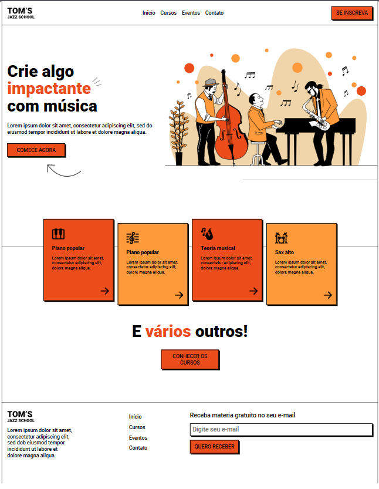

Estudo de caso: Landing page responsive.

Nesse projeto o obejtivo era criar uma landing page que você responsive, principalmente para ser vista no móbile.
Aproveitei para inserir um modal referente LPGD.

Confira a LP: https://vercel.com/anawesthpal/landing-page-music/4NJQkcAiFqxCnC4kNJVffpbbTQ7J

